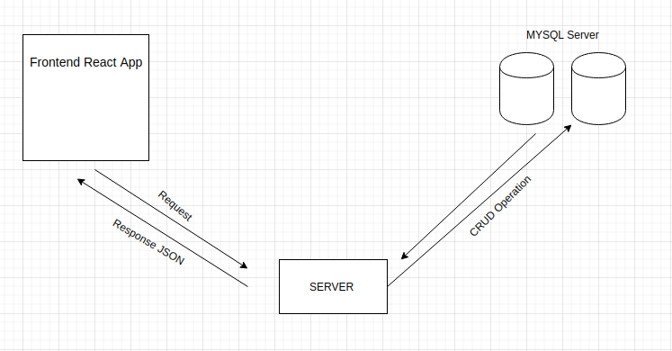

# Entry Management Software : Innovaccer challenge

Project Hosted On Heroku and You can access through this link (https://assignment-front.herokuapp.com/)

## Problem Statement
    Given the visitors that we have in office and outside, there is a need to for an entry management software.
## Approach Used:

    MYSQL SERVER:
    it contains three tables:-
            Host(to store Host Details)
            Visitor(to store current Visitor Details)
            Log (to Store All checkout Visitor Details)
    
    
    

This repository contains Backend API code for this software and hosted here (http://innovaccer.herokuapp.com/)

## API :
- POST API:
    - /visitor/checkin   &nbsp;&nbsp;&nbsp;&nbsp;  (to send new visitor data to backend)
    - /visitor/checkout &nbsp;&nbsp;&nbsp;&nbsp;(to send visitor checkout detail to backend)
    - /host/in &nbsp;&nbsp;&nbsp;&nbsp; (to send new host detail to backend)
- GET API:
    - /visitor/checkin &nbsp;&nbsp;&nbsp;&nbsp; (to get all current checkin visitor)
    - /host/in &nbsp;&nbsp;&nbsp;&nbsp; (to get all register host)
    - /all &nbsp;&nbsp;&nbsp;&nbsp; (to get all visitor that already checkout)

## Repository for frontend App Code:
 here(https://github.com/rishi2907/summergeeks-innovaccer-frontend)
 hosted at (https://assignment-front.herokuapp.com/)

## Installation
    prerequisite to run this software Node.js v4+ to run , MYSQL server
    For Backend API run

    1: Clone this Repository
         $ git clone https://github.com/rishi2907/summergeeks-innovaccer.git
    2: Change directory
         $ cd summergeeks-innovaccer
    3: Need to Start MYSQL Server and create user with USERNAME : user , PASSWORD     :password having All privileges
    4: Install the dependencies
        $ npm install
    5: Run Server
        $ npm start

    Now server is running ...

    For Frontend React App:
    1: Clone React App Repository
        $ git clone https://github.com/rishi2907/summergeeks-innovaccer-frontend
    2: Change directory
        $ cd summergeeks-innovaccer-frontend
    3: Install The Dependencies:
        $ npm install
    4:  Run Reeact Server
        $ npm start

#### Tools and Technology Used :
 - HTML
 - CSS
 - React Semantic UI
 - React
 - MySQL
 - NodeJS
 - ExpressJS
 - Sequelize
